# Crisis Radar

**An LLM-assisted daily macro risk dashboard.** It tracks one concrete investment thesis — *"a fertilizer/energy supply crisis in late 2026 drives inflation and hurts AI-fund valuations"* — by researching the web every day, scoring three indicator clusters with a **deterministic, config-driven engine**, and emitting a **rotation signal** only when crisis pressure stays elevated over a sustained window.

> **Status: design phase.** This repository currently contains *specifications and diagrams only* — no application code yet. The documents under [`docs/`](docs/) are the contract a follow-up implementation step (human or LLM) builds against.

> **Disclaimer.** Crisis Radar is a personal research aid, **not financial advice**. The scoring is an explicit heuristic with hand-chosen weights; every threshold lives in [`config/scoring.example.yaml`](config/scoring.example.yaml) and is meant to be tuned. The tool surfaces evidence and a number — the human decides.

---

## The thesis in one picture

```mermaid
flowchart LR
    web["Public web<br/>(news, prices, reports)"] -->|daily research| extract["LLM extraction<br/>(structured + cited)"]
    extract --> ind["Indicators<br/>(raw measured values)"]
    ind --> score["Deterministic scorer<br/>(config-driven rules)"]
    score --> report["Daily report<br/>3 cluster scores + total"]
    report --> store["History store"]
    store --> trend["Trend / signal detector"]
    trend -->|sustained > +30| signal["Rotation signal"]
    report --> notify["Notify (console / Telegram)"]
    signal --> notify
```



The single most important design line: **the LLM only reads the messy world and extracts cited values; all arithmetic that produces the score is deterministic, testable Python.** No model "vibes" enter the final number. See [ADR-0001](docs/adr/0001-llm-extracts-deterministic-engine-scores.md).

## What it measures

Three clusters, each scored in `[-100, +100]`, the total is their mean:

| Cluster | Question it answers | Example indicators |
|---|---|---|
| **AI-fund health** | Is the AI trade getting stronger or weaker? | product announcements, AI-startup funding, rate expectations, tech 5-day performance, negative AI news |
| **Fertilizer crisis** | Is a fertilizer/energy supply shock building? | TTF gas price, production outages, Strait of Hormuz status, harvest forecasts, import costs, Iran-conflict escalation |
| **Oil proxy** | Does the energy/geopolitics backdrop confirm it? | WTI crude price, Middle-East tension, refinery outages, Hormuz shipping-insurance premiums |

The full, machine-readable rule set lives in [`docs/scoring-spec.md`](docs/scoring-spec.md) and [`config/scoring.example.yaml`](config/scoring.example.yaml).

## The signal that actually matters

A single day above `+30` is noise. The **rotation signal** fires only when the total score holds above the threshold for a *sustained window* (default ~3 trading weeks). That sustained-pressure rule — not the daily number — is the product. See [`docs/data-model.md` § Signal](docs/data-model.md).

## Documentation map

| Document | What it gives the implementer |
|---|---|
| [`docs/architecture.md`](docs/architecture.md) | System architecture, C4 + sequence + data-flow diagrams, module layout, ports & adapters, tech stack, cross-cutting concerns |
| [`docs/implementation.md`](docs/implementation.md) | Phased build plan with acceptance gates and a milestone Gantt |
| [`docs/scoring-spec.md`](docs/scoring-spec.md) | The exact scoring model — every indicator, rule, threshold, clamp |
| [`docs/data-model.md`](docs/data-model.md) | Domain entities, ER diagram, JSON Schema for the daily report |
| [`docs/research-pipeline.md`](docs/research-pipeline.md) | How LLM research + structured extraction + citations work; source registry |
| [`docs/adr/`](docs/adr/) | Architecture Decision Records — the *why* behind each major choice |
| [`config/scoring.example.yaml`](config/scoring.example.yaml) | The scoring config as the single machine-readable source of truth |
| [`schemas/daily_report.schema.json`](schemas/daily_report.schema.json) | JSON Schema contract for the daily report output |

## Planned usage (future, once implemented)

```bash
# Run today's research + scoring, write the report, check for a signal
crisis-radar run

# Re-score a past day from already-stored indicators (deterministic, no web)
crisis-radar rescore 2026-06-08

# Print the trend and current signal state
crisis-radar trend --window 15
```

A daily cron/systemd timer drives `crisis-radar run`; the app itself stays a stateless CLI (12-factor). See [`docs/architecture.md` § Scheduling](docs/architecture.md).
