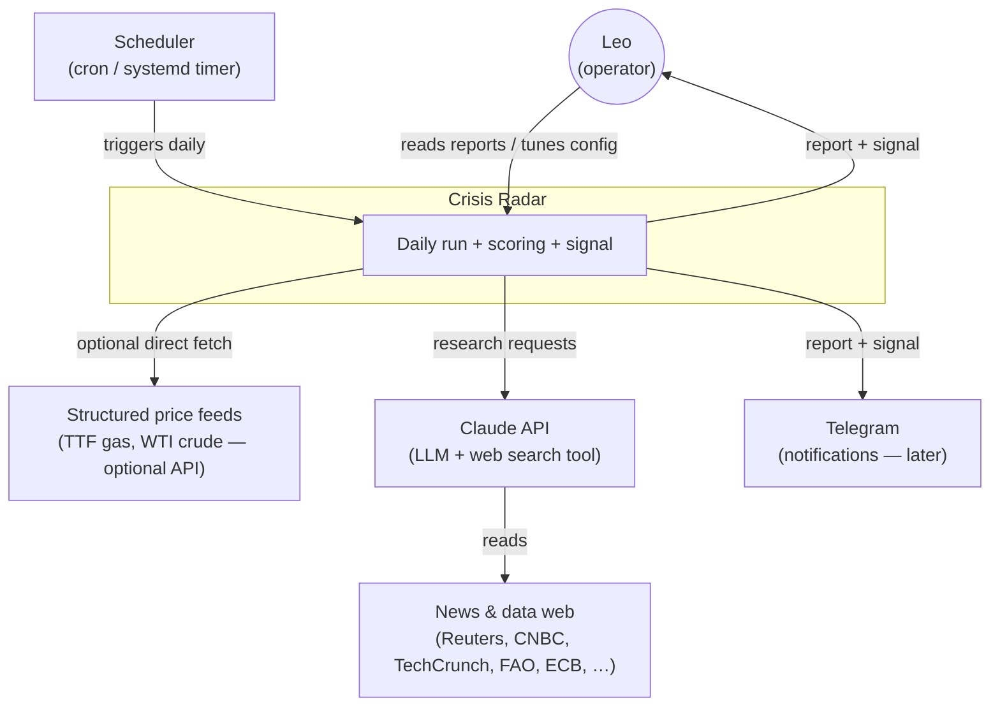
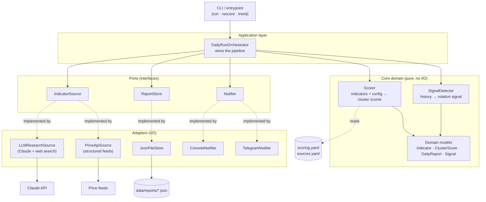
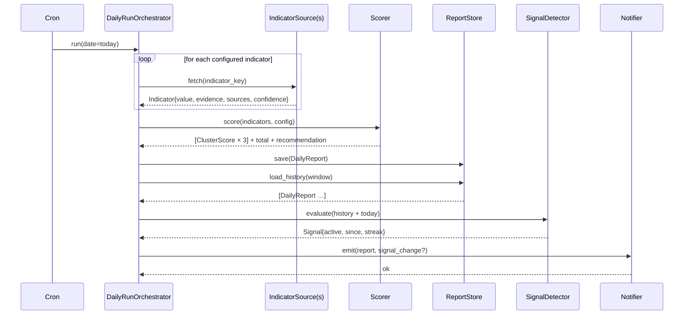

# Architecture

This document is the **canonical technical picture** of Crisis Radar. It is written so that a follow-up implementer — human or LLM — can build the system safely and consistently without re-deriving design intent. Read it together with [`scoring-spec.md`](scoring-spec.md) (the domain rules), [`data-model.md`](data-model.md) (the contracts), and the [ADRs](adr/) (the *why*).

## 1. Purpose & scope

Crisis Radar runs **once per day**. Each run:

1. **Researches** a fixed set of indicators on the public web (and structured price feeds).
2. **Extracts** each indicator as a typed value *with citations and a confidence* (LLM, structured output).
3. **Scores** three clusters deterministically from those indicators using a config file.
4. **Persists** the day's report (indicators + scores + evidence).
5. **Analyzes the trend** across history and decides whether a **rotation signal** is active.
6. **Notifies** (console first; Telegram later) with the report and any signal change.

It is a single-user, single-thesis tool. It is intentionally small. It is **not** a trading bot, has no broker integration, and places no orders.

## 2. Design principles

These are non-negotiable and every later decision must respect them.

1. **Fuzzy in, crisp out.** The LLM lives only at the boundary where the messy world is turned into typed, cited indicator values. Everything downstream — scoring, clamping, averaging, signal detection — is pure, deterministic Python. *(ADR-0001)*
2. **Config over code.** Every threshold, weight, band, and cap lives in `config/scoring.yaml`, never as a literal in the engine. Tuning the thesis means editing YAML, not Python. *(ADR-0002)*
3. **Auditability by default.** Every point in the final score is traceable: `score → rule → indicator → cited source`. A report you cannot explain line-by-line is a bug. *(ADR-0006)*
4. **Unknown ≠ zero-guess.** If research cannot find an indicator, it is recorded as `unknown` (contributing 0 to the score) and flagged — never silently invented. *(ADR-0006)*
5. **Ports & adapters.** The core domain depends on interfaces (`IndicatorSource`, `ReportStore`, `Notifier`), never on concrete I/O. LLM research, price APIs, file storage and Telegram are swappable adapters. *(ADR-0005)*
6. **12-factor, stateless app.** The application is a CLI invoked by an external scheduler. All state is in the data directory; all secrets in the environment. A fresh machine + the data dir + `.env` fully reconstructs the tool.
7. **Small and inspectable.** Daily reports are human-readable JSON on disk. No service to babysit, no database to operate for the MVP.

## 3. C4 Level 1 — System context



## 4. C4 Level 2 — Containers & components

Crisis Radar is a single deployable (one Python package). The "containers" below are logical layers within it.



## 5. Planned package layout

```
crisis-radar/
├── pyproject.toml
├── config/
│   ├── scoring.yaml            # thresholds, weights, caps, recommendation bands  (ADR-0002)
│   └── sources.yaml            # indicator → source registry (URLs, query hints)
├── data/                       # runtime, git-ignored
│   └── reports/YYYY-MM-DD.json
├── schemas/
│   └── daily_report.schema.json
├── src/crisis_radar/
│   ├── __init__.py
│   ├── cli.py                  # typer CLI: run / rescore / trend / backfill
│   ├── config.py               # load + validate scoring.yaml, sources.yaml (pydantic)
│   ├── domain/
│   │   ├── models.py           # Indicator, ClusterScore, DailyReport, Signal (pydantic)
│   │   ├── scorer.py           # pure scoring engine (config-driven rules)
│   │   ├── rules.py            # band / count / enum / bool rule evaluators
│   │   └── signal.py           # SignalDetector (trend over history)
│   ├── ports.py                # IndicatorSource, ReportStore, Notifier (Protocols)
│   ├── adapters/
│   │   ├── research_llm.py      # Claude + web search → structured indicators
│   │   ├── price_api.py         # structured numeric feeds (gas, oil)
│   │   ├── store_json.py        # JSON-file report store
│   │   ├── notify_console.py
│   │   └── notify_telegram.py
│   ├── application/
│   │   └── orchestrator.py      # DailyRunOrchestrator
│   └── reporting/
│       └── render.py            # report → markdown / Leo's fixed text format
└── tests/
    ├── fixtures/                # canned indicator sets
    ├── test_scorer.py           # deterministic — the heart of the test suite
    ├── test_signal.py
    └── test_rules.py
```

## 6. The daily run — sequence



## 7. Data flow & the determinism boundary

```mermaid
flowchart LR
    subgraph fuzzy["Non-deterministic boundary (LLM + web)"]
        direction TB
        q["Per-indicator<br/>research query"] --> llm["Claude + web search"]
        llm --> raw["Structured extraction<br/>value · evidence · URLs · confidence"]
    end

    subgraph crisp["Deterministic core (pure functions, unit-tested)"]
        direction TB
        rules["Apply scoring rules<br/>(band / count / enum / bool)"] --> clamp["Clamp each cluster to [-100, +100]"]
        clamp --> mean["Total = mean(clusters)"]
        mean --> rec["Map to recommendation band"]
    end

    raw --> rules
    rec --> rep["DailyReport (persisted)"]
    rep --> trendwin["Trend over N days"] --> sig["Rotation signal"]
```



Everything left of the boundary is recorded verbatim (what was found, where). Everything right of it is reproducible: `rescore` re-runs the crisp core over stored indicators and **must** produce a byte-identical score. This is what makes the tool trustworthy and testable.

## 8. Ports & adapters

| Port (interface) | Responsibility | MVP adapter | Later adapter |
|---|---|---|---|
| `IndicatorSource.fetch(key) -> Indicator` | Produce one indicator's value + evidence + confidence | `LLMResearchSource` (Claude + web search) for qualitative; `PriceApiSource` for hard numbers | additional structured feeds |
| `ReportStore.save / load / history` | Persist & retrieve daily reports | `JsonFileStore` (`data/reports/*.json`) | `SqliteStore` (if history queries grow) |
| `Notifier.emit(report, signal_change)` | Deliver the result | `ConsoleNotifier` (stdout + markdown file) | `TelegramNotifier` (via existing Telegram infra) |

The orchestrator depends only on the ports. Swapping an adapter never touches the core.

## 9. Tech stack & rationale

| Concern | Choice | Why |
|---|---|---|
| Language | **Python 3.12+** | Matches the rest of the home stack; best fit for Claude SDK + data work |
| LLM / research | **`anthropic` SDK**, Claude with the **web search tool** | First-class structured output (tool use) for clean extraction with citations |
| Models / validation | **pydantic v2** | Typed domain + free JSON (de)serialization + schema generation |
| Config | **YAML (PyYAML)** + pydantic validation | Human-tunable scoring without code edits (ADR-0002) |
| Storage | **JSON files** (one per day) | Git-friendly, inspectable, zero-ops; SQLite deferred until needed (ADR-0004) |
| CLI | **typer** | Minimal, typed subcommands (`run` / `rescore` / `trend`) |
| Numeric feeds | **httpx** adapter(s), optional | Hard prices (gas, oil) are more reliable from a data API than scraped prose |
| Tests | **pytest** | The scorer is unit-tested against fixture indicators — fully deterministic |
| Lint / type | **ruff + mypy** | Cheap correctness on a small codebase |

## 10. Cross-cutting concerns

- **Error handling.** A single indicator failing to resolve must never abort the run. It becomes an `unknown` indicator (score contribution 0, flagged in the report). The run always produces a report; partial data is explicit, not silent.
- **Anti-hallucination.** Extraction is schema-constrained and **requires** at least one citation for any non-`unknown` value. No citation ⇒ value is downgraded to `unknown`. See [`research-pipeline.md`](research-pipeline.md).
- **Rate limits & caching.** Slow-moving indicators may be cached intra-day; price feeds and web search calls respect provider limits. Cache lives under `data/.cache/` and is never a source of truth.
- **Observability.** Each run logs structured lines (one per indicator: key, value, confidence, n_sources) and writes the full report JSON. The report *is* the audit log.
- **Determinism & testing.** The scorer + signal detector are pure. `tests/test_scorer.py` feeds fixture indicators and asserts exact scores; changing `scoring.yaml` and re-running `rescore` over stored history is a supported, expected operation.
- **Secrets.** `ANTHROPIC_API_KEY` (and later Telegram token) come from the environment / `.env`, never committed.
- **Time.** "Today" is resolved once at run start and threaded through; trend windows count stored report days, not wall-clock — so backfilling and replays behave predictably.

## 11. Scheduling

The app is a stateless CLI. A daily trigger lives **outside** it:

```cron
# Run every morning; the app does research, scoring, persistence, notify
30 7 * * *  cd ~/repos/crisis-radar && crisis-radar run >> data/run.log 2>&1
```

This keeps the application 12-factor and trivially testable by hand (`crisis-radar run` any time). No internal scheduler, no daemon.

## 12. Known limitations & methodology caveats

Stated honestly so the implementer (and future-Leo) treat the score as a heuristic, not a truth:

1. **Hand-chosen weights.** All point values come from the original framework. They are *opinions encoded as numbers*. The config-driven design exists precisely so they can be revised after the tool produces real history.
2. **Cross-cluster correlation.** Middle-East geopolitics, the Strait of Hormuz, and the Iran conflict influence **both** the fertilizer cluster (gas feedstock) **and** the oil cluster. Averaging the three clusters therefore *double-counts* energy/geopolitics to some degree. This is intentional in the source framework (oil is an explicit *proxy* / confirmation cluster) but the implementer should keep it visible — see `scoring-spec.md` § Correlation note.
3. **Mean of three clusters** treats AI-fund health and crisis indicators as equally weighted and independent. A weighted total (or a min/max blend) may model the thesis better; the config supports adding cluster weights later.
4. **No look-ahead / backtest.** The tool scores the present from news; it does not validate that the thesis was historically predictive. Treat early output as calibration data.
5. **Source reliability varies.** Hard numbers (gas, oil) should come from price feeds; qualitative cues (escalation level, harvest warnings) are LLM judgments over news and carry the confidence field for exactly this reason.

## 13. Normalization note — "Hornmus" → "Strait of Hormuz"

The source framework referred to a *"Hornmus-Schiffsverkehr"* blockade indicator in the fertilizer cluster, while the oil cluster separately referenced *"Hormus"* shipping insurance. These are the same chokepoint: the **Strait of Hormuz** (German *Straße von Hormus*). *"Hornmus"* is a voice-transcription artifact. Throughout this repository the indicator is standardized to **`hormuz_status`** / **Strait of Hormuz**. Flagged here so the rename is a documented decision, not a silent edit.
