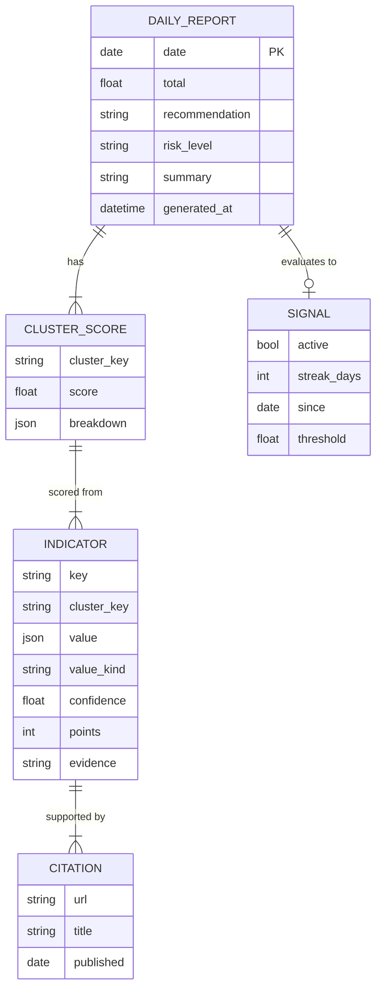

# Data Model

The contracts every layer shares. These are the pydantic models in `src/crisis_radar/domain/models.py` and the on-disk JSON shape. The authoritative output schema is [`../schemas/daily_report.schema.json`](../schemas/daily_report.schema.json).

## Entity overview



## Indicator

The atomic unit of measured truth. Produced by an `IndicatorSource`, consumed by the `Scorer`.

| Field | Type | Notes |
|---|---|---|
| `key` | str | e.g. `gas_ttf_eur_mwh` — matches a key in `scoring.yaml` |
| `cluster_key` | enum | `ai_fund_health` \| `fertilizer_crisis` \| `oil_proxy` |
| `value` | number \| int \| bool \| str | the raw measured value; `str` for enums |
| `value_kind` | enum | `number` \| `count` \| `enum` \| `bool` \| `unknown` |
| `confidence` | float `0.0–1.0` | LLM/source confidence; price-feed values ≈ `1.0` |
| `citations` | list[Citation] | **≥ 1 required** unless `value_kind == unknown` |
| `evidence` | str | one-sentence justification quoted/paraphrased from a source |
| `points` | int | filled by the `Scorer`, not the source (stays `null` until scored) |
| `extracted_at` | datetime | when research produced it |

**`unknown` rule:** if research cannot resolve an indicator, it is emitted with `value_kind = unknown`, `confidence ≈ 0`, empty citations, and contributes **0 points**. It is never dropped — its absence stays visible in the report.

## Citation

| Field | Type | Notes |
|---|---|---|
| `url` | str | source link |
| `title` | str | headline / page title |
| `published` | date \| null | publication date if known |

## ClusterScore

| Field | Type | Notes |
|---|---|---|
| `cluster_key` | enum | the cluster |
| `score` | float | Σ of indicator points, clamped to `[-100, +100]` |
| `breakdown` | list[{key, points}] | per-indicator contribution — the audit trail |

## DailyReport

The persisted output, one per day, written to `data/reports/YYYY-MM-DD.json`.

| Field | Type | Notes |
|---|---|---|
| `date` | date | the report day (primary key) |
| `clusters` | list[ClusterScore] | exactly three |
| `indicators` | list[Indicator] | all raw indicators, with citations |
| `total` | float | `mean(cluster scores)` |
| `recommendation` | enum | `rotate` \| `half_position` \| `observe` \| `no_rotation` |
| `risk_level` | enum | `low` \| `medium` \| `elevated` |
| `summary` | str | short narrative for humans |
| `signal` | Signal | trend evaluation as of this report |
| `generated_at` | datetime | run timestamp |
| `schema_version` | str | for forward migration |

## Signal

Derived from history, not from a single day. The reason the tool exists.

| Field | Type | Notes |
|---|---|---|
| `active` | bool | rotation signal currently firing |
| `streak_days` | int | consecutive days `total > threshold` (e.g. `9` while building) |
| `required_days` | int | from config (default `15`) |
| `since` | date \| null | first day of the active streak |
| `threshold` | float | the rotation threshold in effect (default `+30`) |

## Fixed text-report format

In addition to JSON, the renderer reproduces the operator-facing layout from the original brief (the `CLUSTER 1 / 2 / 3 → GESAMTSCORE → HANDLUNGSEMPFEHLUNG` tree). That rendering is a *view* over `DailyReport`, not a second source of truth — see `src/crisis_radar/reporting/render.py`.

## Example instance

A minimal valid `DailyReport` (trimmed indicators) — see the JSON Schema for the full contract:

```json
{
  "schema_version": "1.0",
  "date": "2026-06-08",
  "clusters": [
    {"cluster_key": "ai_fund_health",    "score": 7.0,  "breakdown": [{"key": "product_announcements", "points": 10}]},
    {"cluster_key": "fertilizer_crisis", "score": 49.0, "breakdown": [{"key": "gas_ttf_eur_mwh", "points": 20}]},
    {"cluster_key": "oil_proxy",         "score": 52.0, "breakdown": [{"key": "wti_usd_bbl", "points": 25}]}
  ],
  "indicators": [
    {
      "key": "gas_ttf_eur_mwh", "cluster_key": "fertilizer_crisis",
      "value": 58.0, "value_kind": "number", "confidence": 0.95, "points": 20,
      "evidence": "TTF front-month settled at €58/MWh on 2026-06-08.",
      "citations": [{"url": "https://example.com/ttf", "title": "European gas rises", "published": "2026-06-08"}],
      "extracted_at": "2026-06-08T07:31:00Z"
    }
  ],
  "total": 36.0,
  "recommendation": "rotate",
  "risk_level": "elevated",
  "summary": "Energy + geopolitics elevated; AI cluster roughly flat. One day only — no sustained signal yet.",
  "signal": {"active": false, "streak_days": 1, "required_days": 15, "since": null, "threshold": 30.0},
  "generated_at": "2026-06-08T07:32:10Z"
}
```
