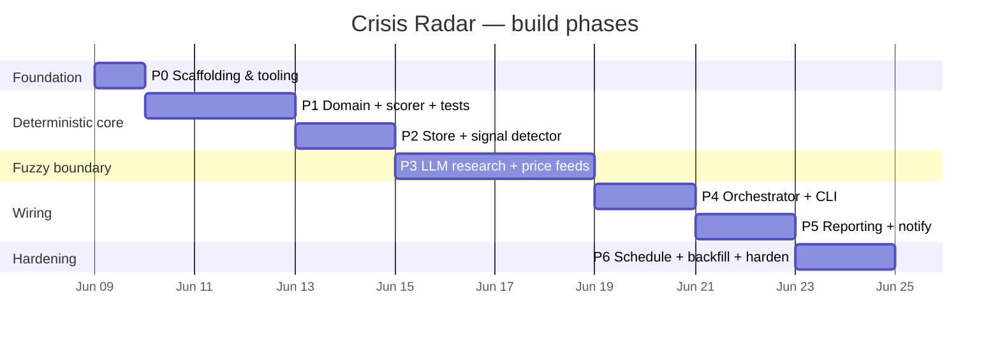

# Implementation Plan

A phased build, ordered so the **trustworthy core (deterministic scoring) ships and is tested before any LLM touches it.** Each phase has concrete deliverables and an acceptance gate; do not start a phase before the previous gate is green.

## Guiding sequencing rule

> **Crisp before fuzzy.** Build and unit-test the deterministic scorer and signal detector against fixture indicators *first*. Only then add the LLM research layer that fills those indicators from the real web. This way the part that produces the number is provably correct independent of any model behavior.

## Milestones

---

## Phase 0 — Scaffolding & tooling

**Goal:** a runnable, linted, empty skeleton.

- `pyproject.toml` (package `crisis_radar`, deps: `anthropic`, `pydantic`, `pyyaml`, `typer`, `httpx`; dev: `pytest`, `ruff`, `mypy`).
- Package layout from [architecture.md §5](architecture.md#5-planned-package-layout).
- `config/scoring.yaml` (copy the committed `scoring.example.yaml`), `config/sources.yaml` stub.
- CI-equivalent local target: `ruff check && mypy src && pytest`.

**Gate:** `pip install -e .` succeeds; `crisis-radar --help` prints subcommands; `pytest` runs (zero tests OK).

## Phase 1 — Domain models + deterministic scorer

**Goal:** the heart. Indicators in, scores out, no I/O.

- `domain/models.py` — `Indicator`, `Citation`, `ClusterScore`, `DailyReport`, `Signal` (pydantic v2), matching [data-model.md](data-model.md).
- `config.py` — load + **validate** `scoring.yaml` into typed config (fail loudly on unknown indicator keys, malformed bands).
- `domain/rules.py` — evaluators for `band` / `count` / `enum` / `bool` with caps.
- `domain/scorer.py` — `score(indicators, config) -> (clusters, total, recommendation, risk_level)`; per-cluster clamp; mean; band mapping.
- `tests/fixtures/` — canned indicator sets including the worked example in [scoring-spec.md §8](scoring-spec.md#8-worked-example).
- `tests/test_rules.py`, `tests/test_scorer.py` — assert **exact** integer/float scores, including clamping and `unknown → 0`.

**Gate:** the worked example yields `total == 36.0`, `recommendation == "rotate"`; clamp and unknown cases covered; `mypy` clean. **No `anthropic` import anywhere in `domain/`.**

## Phase 2 — Store + signal detector

**Goal:** persistence and the sustained-pressure signal.

- `ports.py` — `ReportStore` protocol.
- `adapters/store_json.py` — `save`, `load(date)`, `history(window)` over `data/reports/*.json`.
- `domain/signal.py` — `SignalDetector.evaluate(history) -> Signal` implementing the consecutive-days rule ([scoring-spec.md §6](scoring-spec.md#6-the-rotation-signal-the-actual-product)).
- `tests/test_signal.py` — streak building, fire at `required_days`, reset on a break, `since` correctness.

**Gate:** signal fires at exactly `consecutive_days`, resets correctly, `streak_days` reported while building; round-trip save/load is loss-free and schema-valid.

## Phase 3 — Research layer (the LLM boundary)

**Goal:** fill real indicators from the web, with citations + confidence.

- `ports.py` — `IndicatorSource` protocol.
- `adapters/research_llm.py` — Claude + **web search tool**, structured output per indicator (see [research-pipeline.md](research-pipeline.md)). Enforces: ≥1 citation or `unknown`; confidence; evidence sentence.
- `adapters/price_api.py` — structured numeric source for `gas_ttf_eur_mwh`, `wti_usd_bbl` (more reliable than scraped prose). Indicator routing lives in `sources.yaml`.
- `config/sources.yaml` — indicator → {source_type, query hints, allowed domains}.
- Tests: mock the Claude client; assert the extraction contract (no-citation ⇒ `unknown`, malformed ⇒ `unknown`, never crashes the run).

**Gate:** a recorded/mocked research call yields schema-valid `Indicator`s; missing-data path produces `unknown`, not a guess or a crash.

## Phase 4 — Orchestrator + CLI

**Goal:** one command runs the whole pipeline.

- `application/orchestrator.py` — `DailyRunOrchestrator.run(date)`: fetch all indicators (in parallel where safe) → score → save → load history → signal → notify. One indicator failing ⇒ `unknown`, run continues.
- `cli.py` — `run`, `rescore <date>` (re-score stored indicators, **no web**, must reproduce), `trend --window N`, `backfill`.

**Gate:** `crisis-radar run` end-to-end against mocked sources writes a valid report and prints the summary; `rescore` reproduces a stored day's `total` exactly (determinism proof).

## Phase 5 — Reporting + notification

**Goal:** human-facing output.

- `reporting/render.py` — markdown report **and** the original fixed text layout (`CLUSTER 1/2/3 → GESAMTSCORE → HANDLUNGSEMPFEHLUNG`).
- `adapters/notify_console.py` — stdout + write `data/reports/YYYY-MM-DD.md`.
- `adapters/notify_telegram.py` — push report + signal *changes* via existing Telegram infra (off by default; enabled via env).

**Gate:** rendered text matches the brief's layout; Telegram adapter is opt-in and never fires on import.

## Phase 6 — Scheduling, backfill, hardening

**Goal:** runs itself, recovers, behaves.

- Cron/systemd-timer snippet ([architecture.md §11](architecture.md#11-scheduling)).
- `backfill` command to score a date range from re-research (rate-limited).
- Resilience: retries with backoff on transient API errors; cache for slow-moving indicators under `data/.cache/`.
- `README` quickstart finalized; `.env.example` added.

**Gate:** a scheduled run produces a dated report unattended; a forced API failure degrades to `unknown` indicators rather than aborting.

---

## Definition of Done (every phase)

1. `ruff check && mypy src && pytest` all green.
2. New behavior covered by a deterministic test (no network in unit tests).
3. No magic numbers in `domain/` — scoring values come only from config.
4. Docs updated if a contract changed (this file, `data-model.md`, or `scoring-spec.md`).

## Out of scope (explicitly)

No broker/order execution, no portfolio accounting, no multi-thesis support, no web UI in the MVP. These are deliberately excluded to keep the tool small and trustworthy; revisit only after the daily report has produced real history.
