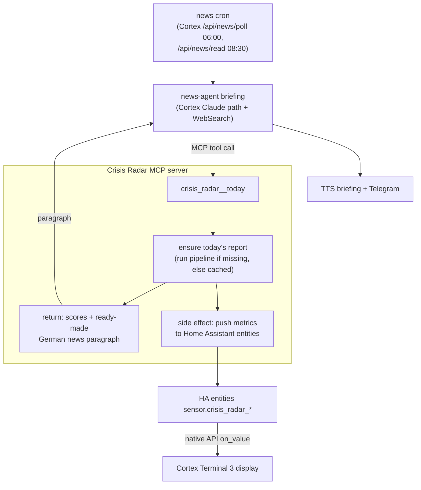
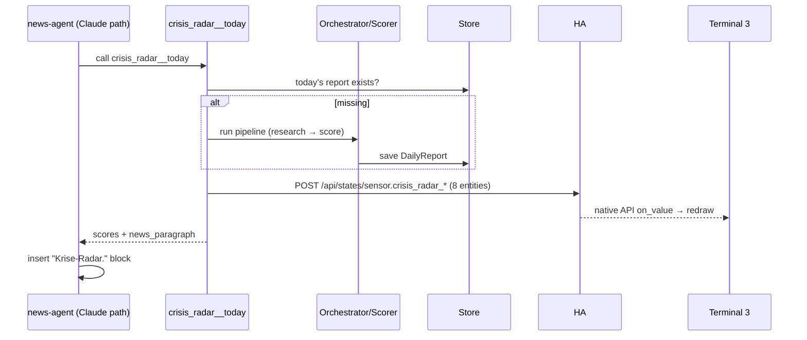

# Integration: MCP server, the news briefing, and the Cortex display

This document defines how Crisis Radar plugs into Leo's home system. It adds **one integration surface — an MCP server** — and a single daily trigger that fans out to two consumers:

1. the **news-agent morning briefing** (Crisis Radar appears as its own news paragraph), and
2. the **Cortex Terminal 3** wall display (the metrics are pushed into Home Assistant, the ESP renders them).

> Design rule that shapes everything here: **one trigger, two outputs, no duplicate work.** The same `crisis_radar__today` MCP call that hands the briefing its paragraph also updates the display. There is no second cron, no polling loop, no second code path that recomputes the score.

## The one trigger



The news-agent is the de-facto daily trigger. Its briefing run calls the tool; the tool guarantees today's report exists, returns the paragraph, and pushes the display values. If the briefing didn't run (weekend, outage), the report simply isn't produced that day — which is honest, and a standalone `crisis-radar run` cron can be added later as a fallback if Leo wants 7-day coverage.

## Why MCP (and not a thin HTTP call)

The news briefing is generated by an **LLM with tools** (Cortex's Claude path, already WebSearch-enabled). The native way to give an LLM a capability is a tool — so Crisis Radar exposes an **MCP server**, exactly like the home's existing `nvda-cpi-watch`, `worker-mcp`, `nabu-mcp`. The briefing's system prompt simply tells it to call the tool and paste the result. This is *format-transformation + state-mutation*, not a pass-through: the tool runs the pipeline, persists the report, pushes to HA, and renders a human paragraph. Real work at the hop → justified (no "dünner Durchreicher").

For non-LLM consumers, the server also ships an optional `http_server.py` REST mirror (the house pattern — see `worker-mcp`), so the display *could* poll `GET /today` as a fallback. The **primary** display path is the HA push, because the value changes once a day and a push beats polling.

## MCP server

Follows the house pattern (`mcp` SDK, stdio transport, `ns__tool` naming), registered via a repo-local `.mcp.json` just like `nvda-cpi-watch`:

```json
{
  "mcpServers": {
    "crisis-radar": {
      "command": "/home/leona/repos/crisis-radar/.venv/bin/python",
      "args": ["/home/leona/repos/crisis-radar/src/crisis_radar/mcp_server.py"]
    }
  }
}
```

### Tools

| Tool | Purpose | Returns |
|---|---|---|
| `crisis_radar__today` | Ensure today's report exists (run the daily pipeline if missing, else load cached), **push the metrics to HA**, and return the result. Idempotent per day. | structured scores **+** `news_paragraph` (German, ready to embed) |
| `crisis_radar__trend` | Signal/streak over the recent window (no recompute, reads stored history). | `{active, streak_days, required_days, total_series}` |
| `crisis_radar__rescore` *(optional)* | Re-score a stored day deterministically (no web, no HA push). Debug/tuning. | the recomputed `DailyReport` |

`crisis_radar__today` result shape:

```json
{
  "date": "2026-06-08",
  "total": 36.0,
  "clusters": {"ai_fund_health": 7.0, "fertilizer_crisis": 49.0, "oil_proxy": 52.0},
  "recommendation": "rotate",
  "risk_level": "elevated",
  "signal": {"active": false, "streak_days": 1, "required_days": 15},
  "news_paragraph": "Krise-Radar. Der Gesamtscore steht heute bei plus 36 …"
}
```

The side effect (HA push) is implemented as a `Notifier` adapter — see the [`HomeAssistantNotifier`](#home-assistant-entity-contract) below — wired into the orchestrator, so the MCP handler stays a thin call over the same core the CLI uses. The tool is **idempotent per day**: the first call of the day runs the pipeline; later calls return the cached report and re-push the (unchanged) HA values.

## News side — the extra paragraph

The news-agent's brain is `~/repos/news-agent/prompt.md`; its briefing already has a **"Krisen-Radar."** and **"Finanz-Kompass."** section. Crisis Radar slots in as its own **"Krise-Radar."** block (a distinct, score-driven paragraph), kept separate from the qualitative crisis section.

**Planned `prompt.md` addition** (cross-repo change — apply at implementation time, not now):

```
Krise-Radar.
Du hast ein MCP-Tool `crisis_radar__today`. Ruf es genau EINMAL auf und gib
sein Feld `news_paragraph` als eigenen, klar abgegrenzten Absatz wieder —
Gesamtscore, die drei Cluster (KI-Fonds, Dünger, Öl) in einem Satz, die
Handlungs-Tendenz und der Signal-Stand (z.B. "9 von 15 Tagen über Schwelle").
Ton wie der Rest: Anregung mit Wahrscheinlichkeit, kein Kauf-/Verkaufsbefehl.
Wenn das Tool nicht erreichbar ist: den Block ersatzlos weglassen.
```

**Wiring point:** the news briefing runs through Cortex's Claude path (`~/cortex/events/news.py` → bridge — note 2026-09-15: `events/news.py` was removed in cortex `b5ed6de` (MB-612); news delivery now lives in `~/cortex/news_bot.py` + `main.py` `_news_read_tick`). That invocation must load `crisis-radar`'s `.mcp.json` (add it to the news Claude call's `--mcp-config`, or to the `cortex-claude-chat` MCP set). This is the one cross-repo touch the integration needs on the Cortex side.

The returned `news_paragraph` is pre-rendered TTS-safe German (no markdown, no symbols) so it drops straight into Part 1 of the briefing and, trimmed, into the `KRISE` Telegram block.

## Display side — Home Assistant entity contract

Crisis Radar's `HomeAssistantNotifier` writes these states via the HA REST API (`POST {HA_URL}/api/states/<entity>`, Bearer token — the same `_ha_api` pattern as `worker-mcp`). **Cortex Terminal 3** (`~/esp_repos/cortex-terminal-3`) imports them via ESPHome `platform: homeassistant` and renders on `on_value`. This is the canonical contract both sides depend on:

| Entity | Kind | Range / values | Drives on the display |
|---|---|---|---|
| `sensor.crisis_radar_total` | number | -100 … +100 | hero score + gauge |
| `sensor.crisis_radar_ai_fund` | number | -100 … +100 | AI-FUND cluster bar |
| `sensor.crisis_radar_fertilizer` | number | -100 … +100 | FERTILIZER cluster bar |
| `sensor.crisis_radar_oil` | number | -100 … +100 | OIL cluster bar |
| `sensor.crisis_radar_recommendation` | string | `rotate` \| `half_position` \| `observe` \| `no_rotation` | recommendation line **+ total color band** |
| `sensor.crisis_radar_risk` | string | `low` \| `medium` \| `elevated` | risk line |
| `sensor.crisis_radar_signal` | string | e.g. `"9/15"`, `"ACTIVE"`, `"—"` | signal line (red when active) |
| `sensor.crisis_radar_updated` | string | ISO date/time | header timestamp |

Color band on the display (driven by `recommendation`): `rotate` → red `0xe94560`, `half_position` → amber `0xffaa00`, `observe` / `no_rotation` → green `0x00ff88`. The ESP renders entirely in the existing CYD design language (deep-space `0x0a0a1a`, Share Tech Mono + Orbitron, phosphor green / cyan). Full display design + UI mockup live in the `cortex-terminal-3` repo.

## Sequence — a morning run



## What changes where (implementation checklist)

- **crisis-radar:** add `src/crisis_radar/mcp_server.py` (stdio MCP, the tools above), `adapters/notify_ha.py` (`HomeAssistantNotifier`), optional `http_server.py` (REST mirror), repo `.mcp.json`, env `HA_URL` + `HA_TOKEN`. The `news_paragraph` renderer lives in `reporting/render.py`.
- **news-agent (cross-repo):** the `prompt.md` "Krise-Radar." block above.
- **Cortex (cross-repo):** load `crisis-radar`'s `.mcp.json` into the news Claude invocation.
- **Home Assistant:** the 8 `sensor.crisis_radar_*` entities exist as soon as the first push writes them (HA creates states on `POST /api/states`).
- **cortex-terminal-3 (new ESP repo):** consumes the entity contract; design-only for now.
