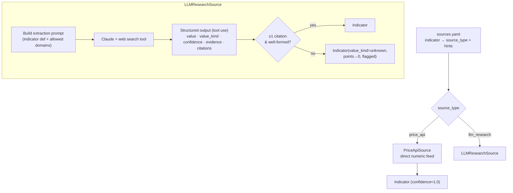

# Research Pipeline

How the **fuzzy boundary** works: turning the public web into typed, cited indicators that the deterministic core can score. This is the only place an LLM operates, and it operates under strict contracts.

## Principle

> The LLM's job is **extraction, not judgement of the score**. It answers "what is the current value of indicator X, and where did you read it?" — nothing about points, clusters, or recommendations. The scoring math never sees the model.

## Per-indicator research

Each indicator is researched independently (parallelizable), routed by `config/sources.yaml`:



### Two source types

| Source type | Used for | Why |
|---|---|---|
| `price_api` | `gas_ttf_eur_mwh`, `wti_usd_bbl` | Hard numbers must come from a real feed, not scraped prose — deterministic and exact |
| `llm_research` | everything qualitative (escalation level, outages, harvest warnings, announcements, rate signals, news counts) | Requires reading and judging news across many sources |

Mixing the two is an explicit architectural choice (see [ADR-0005](adr/0005-pluggable-indicator-sources.md)): use the reliable channel where one exists, the LLM only where judgement is unavoidable.

## Structured extraction contract

The LLM is forced (via tool use / structured output) to return exactly this shape per indicator:

```json
{
  "value": 58.0,
  "value_kind": "number",
  "confidence": 0.9,
  "evidence": "TTF front-month settled at €58/MWh on 2026-06-08.",
  "citations": [
    {"url": "https://...", "title": "European gas rises", "published": "2026-06-08"}
  ]
}
```

`value_kind` constrains `value`:

| Indicator pattern | `value_kind` | `value` |
|---|---|---|
| numeric (gas, oil, funding, performance %) | `number` | a float |
| count (announcements, outages, news, reports) | `count` | a non-negative int |
| categorical (iran escalation, hormuz, harvest, tension) | `enum` | one allowed string from `sources.yaml` |
| boolean (insurance rising) | `bool` | `true` / `false` |
| nothing found | `unknown` | `null` |

## Anti-hallucination rules (enforced in code, not just prompt)

1. **No citation ⇒ no value.** Any non-`unknown` result with zero citations is *downgraded to `unknown`* by the adapter. The model cannot assert a number it didn't source.
2. **Enum whitelist.** An `enum` value not in the indicator's allowed set ⇒ `unknown`.
3. **Type mismatch ⇒ unknown.** A `number` that won't parse, a `count` that's negative, etc. ⇒ `unknown`.
4. **Confidence is recorded, never used to inflate.** Low confidence still scores (per the deterministic rules) but is visible in the report; `unknown` is the only thing that zeroes a contribution.
5. **Freshness.** Citations should be recent; the adapter records `published` so stale evidence is auditable. (A max-age policy can be added per indicator in `sources.yaml`.)

These run as validation *after* the model responds — the prompt asks for good behavior, the code guarantees it.

## Source registry (`sources.yaml`)

Maps each indicator to where/how to look, derived from the original brief:

| Domain | Indicators | Suggested sources |
|---|---|---|
| Gas price | `gas_ttf_eur_mwh` | ICE, Investing.com, Bloomberg |
| Oil price | `wti_usd_bbl` | CNBC, Reuters, TradingView |
| Fertilizer / agriculture | `production_outages`, `fertilizer_import_costs`, `harvest_forecast` | agrarheute.com, FAO reports, industry portals |
| Geopolitics / Iran / Hormuz | `iran_conflict_escalation`, `hormuz_status`, `mideast_tension`, `hormuz_insurance_rising` | Reuters, Bloomberg, SWP Berlin |
| AI / tech | `product_announcements`, `negative_ai_news` | TechCrunch, The Verge, Hacker News |
| Macro / rates | `rate_hike_signals` | ECB (ecb.europa.eu), central-bank coverage |
| Markets | `ai_startup_funding_weekly_busd`, `tech_performance_5d_pct` | market data + funding trackers |

`allowed_domains` per indicator lets the adapter prefer/whitelist trusted sources for web search and reject citations from elsewhere.

## Determinism boundary (restated)

Research output is recorded verbatim into the `DailyReport` (`indicators[]`, with citations). The `rescore` command re-runs **only** the deterministic core over those stored indicators and must reproduce the score exactly — proving the LLM influenced *what was measured*, never *how it was scored*.
